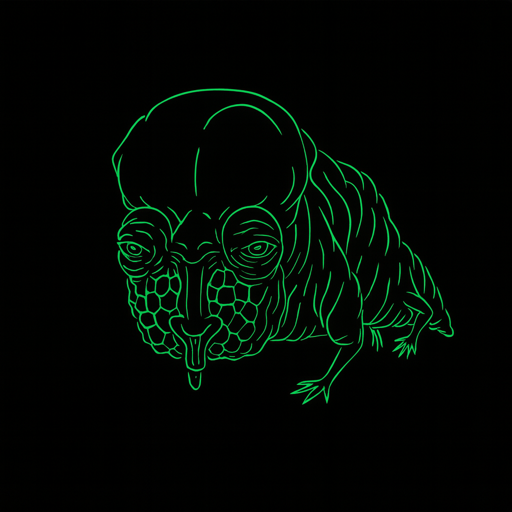

<p align="center">
  
</p>

# CHOAM

[](https://github.com/jlmalone/choam/actions/workflows/ci.yml)
[](https://opensource.org/licenses/MIT)

Cross-machine file synchronization for large media repositories.

## What It Does

CHOAM syncs directories between machines over LAN, Tailscale, or SSH. It handles conflict resolution, bandwidth throttling, SHA-256 verification, and database-aware transfers.

Built for the scenario where you have terabytes of media spread across a desktop, laptop, and server, and you need to keep them in sync without cloud services.

## Features

- **`push` and `pull` commands** — simple one-command transfers: `choam push media --to laptop`
- **Live progress TUI** — real-time progress bar with speed, ETA, and file info
- **Sync history** — persistent log of all syncs, queryable via `choam history`
- **Actionable status** — `choam status` shows drives, repos, machines, last sync times
- **Portable drive support** — drives tracked by UUID, not mount path. Plug a drive into any machine and CHOAM finds it
- **rsync-powered transfers** — delta transfers, resume on interruption, bandwidth limiting
- **Sietch integration** — file cataloging with SHA-256 hashes, catalogs cached on drives
- **Bidirectional sync** with conflict detection and resolution
- **Four conflict strategies**: newer wins, larger wins, keep both, manual
- **SHA-256 verification** on every transferred file
- **Bandwidth throttling** to avoid saturating your network
- **Dry-run mode** to preview changes before executing
- **Database-aware sync** with atomic operations for SQLite files
- **Network detection**: auto-selects LAN, Tailscale, or WAN routes
- **Exclude patterns** for temp files, OS files, etc.
- **Per-machine resource throttling** for safe background operation on shared or low-powered machines
- **`inspect` command** — deep drill-down on any CID or filename: all copies, machines, paths, replication status, transfer estimates
- **`federation` command** — combined view of House identity, peers, shares, and backup agreements
- **Web dashboard** — 8-page Ktor + HTMX browser UI: Dashboard, Search, Media, Drives, Federation, Report, Network, History
- **Full CID display** — search results show complete IPFS CIDs + gateway URLs everywhere (CLI and web)
- **Media browser** — browse and stream media files with content-type filtering, IPFS links, and play buttons
- **Health report** — 10-section dashboard with coverage, replication, copy distribution, risk, staleness, transfer speeds, geo diversity, content classes, dedup, and recommendations
- **Auto-drain (contrib)**: private-route queue drainer in [`contrib/autodrain`](contrib/autodrain/) that runs `choam queue --run` on a schedule when Tailscale is available and the machine is not on a phone hotspot; ExpressVPN is optional for these SSH transfers

## Install

### Homebrew (macOS)

```bash
brew install jlmalone/tap/choam
```

This installs CHOAM and JDK 21 automatically.

### Download from GitHub Releases

1. Download the latest `.zip` from [Releases](https://github.com/jlmalone/choam/releases)
2. Unzip and add the `bin/` directory to your PATH
3. Requires JDK 21+ installed separately

### Build from Source

Requires JDK 21+ and [Sietch](https://github.com/jlmalone/sietch) checked out alongside:

```bash
git clone https://github.com/jlmalone/sietch.git
git clone https://github.com/jlmalone/choam.git
cd choam
./gradlew build
./gradlew installDist
# Binary is at build/install/choam/bin/choam
```

## Quick Start

```bash
# Initialize config
choam init

# Edit your config
vim ~/.choam/config.json

# Push a repo to a remote machine
choam push media --to laptop

# Pull a repo from a remote machine
choam pull media --from server

# Dry run first
choam push media --to laptop --dry-run

# Full sync with route syntax
choam sync media desktop→laptop

# Sync all repositories
choam sync all desktop→laptop

# Bidirectional sync
choam sync media desktop→laptop --bidirectional

# Check status (drives, repos, machines, last sync)
choam status

# View sync history
choam history
choam history --repo media --last 5

# Deep file inspection — drill into any CID or filename
choam inspect bafkreihdwdce...
choam inspect "Aliens"

# Federation summary — house + peers + shares + backups
choam federation

# Health report
choam report

# Web dashboard (8 pages)
choam serve
```

## Portable Drives

```bash
# Scan connected drives to find UUIDs
choam drives scan

# View configured drives and mount status
choam drives
```

Configure drives in `~/.choam/config.json`:
```toml
[drives.movies-4tb]
uuid = "A1B2C3D4-E5F6-7890-ABCD-EF1234567890"
label = "movies-4tb"

[drives.movies-4tb.repositories]
media = "movies"        # relative path on the drive
```

When resolving a repository path, CHOAM checks drives first (by UUID), then falls back to machine paths. This means the same drive works regardless of which machine it's plugged into.

## Configuration

Copy `config.json.example` to `~/.choam/config.json` and edit:

```json
{
  "machines": {
    "desktop": {
      "name": "desktop",
      "hostname": "my-desktop.local",
      "sshUser": "user",
      "tailscaleIp": "100.64.0.1",
      "type": "DESKTOP",
      "repositories": {
        "media": "/home/user/media",
        "archive": "/home/user/archive"
      }
    }
  }
}
```

Define as many machines, drives, and repositories as you need. CHOAM will figure out the best network route automatically.

Machine-specific topology remains outside Git. See
[`docs/TRUSTED_MACHINE_CONTEXT.md`](docs/TRUSTED_MACHINE_CONTEXT.md) for separating
public examples, private agent context, runtime configuration, and secrets.

## Network Routing

CHOAM auto-detects the fastest route between machines:

1. **LAN** — fastest, used when both machines are on the same network
2. **Tailscale** — used when machines are on different networks but both run Tailscale
3. **WAN** — fallback over the internet via SSH

Force a specific route with `--via lan`, `--via tailscale`, or `--via wan`.

## Conflict Resolution

When the same file has been modified on both sides during bidirectional sync:

| Strategy | Behavior |
|----------|----------|
| `NEWER_WINS` | Keep the file with the newer modification time (default) |
| `LARGER_WINS` | Keep the larger file |
| `KEEP_BOTH` | Rename both with timestamps, keep everything |
| `MANUAL` | Skip conflicting files for manual resolution |

## SQLite Backups

CHOAM can copy SQLite files, but `send` is a snapshot transport, not distributed SQLite coordination.

- Keep one authoritative live DB per machine.
- Back up each machine to its own remote path on shared storage.
- Do not have multiple machines target the same remote `.db` filename with `send`.
- Use `choam db-sync` when you need to merge independently-written SQLite databases.
- Use `--strategy timestamp-wins` for tables with timestamp-like columns such as `updatedDate`, `removed_at`, or `downloadTimestamp`; it inserts missing rows and updates PK collisions only when the incoming row is newer.
- Use `--strategy insert-or-ignore` for append-only natural-key catalogs, and `--strategy insert-or-replace` only when pull-order-wins is acceptable.
- For large active databases, checkpoint or copy a snapshot before transfer.

Example shared-drive layout:

```text
/Volumes/BACKUP_DRIVE/app_data/laptop/live/app.db
/Volumes/BACKUP_DRIVE/app_data/server/live/app.db
/Volumes/BACKUP_DRIVE/app_data/desktop/live/app.db
```

## Tech Stack

- Kotlin 2.0 / JVM 21
- Clikt (CLI framework)
- kotlinx.serialization (config)
- kotlinx.coroutines (async I/O)
- rsync (file transfers)
- Sietch (file indexing/hashing via composite build)
- Gradle 8.11

## Name

Named after the **Combine Honnete Ober Advancer Mercantiles** from Frank Herbert's *Dune* — the entity that controlled all trade and transport between worlds. CHOAM moves your data between machines.

## Status

Phases 1 through 9.10 complete (2026-04-04). Full-featured multi-machine sync with federation, health reporting, source protection (SourceGuard), content-verified MOVE, Merkle pre-flight, and browser UI. 939 tests.

Features:
- `push`/`pull` commands with auto-target resolution
- Live progress bar with speed, ETA, current file
- Persistent sync history (JSONL at `~/.choam/sync_history.jsonl`)
- Actionable `status` command with drives, repos, machines, last sync
- Local and remote sync via rsync
- Portable drive support with UUID-based detection
- Sietch-powered file cataloging with IPFS CID hashing
- Cross-machine FTS5 search with full CID display + IPFS gateway URLs
- `inspect` command for deep file drill-down (all copies, transfer estimates)
- `federation` command for combined House/peers/shares/backups view
- `report` with 10-section health dashboard
- 8-page web dashboard (Ktor + HTMX): Dashboard, Search, Media, Drives, Federation, Report, Network, History
- Media browser with content streaming and IPFS links
- Federation: House identity, share ACLs, mutual backup, gossip, bandwidth economy

See `ROADMAP.md` for full phase history and `CLAUDE.md` for CLI reference.

## License

MIT License. See [LICENSE](LICENSE) for details.
